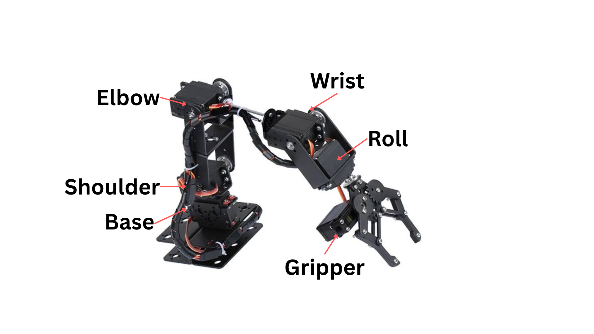
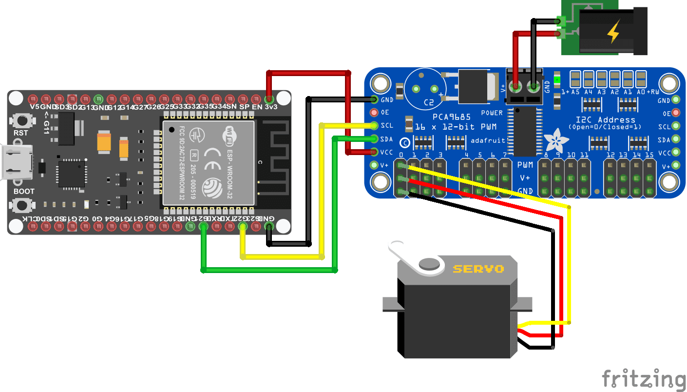

# Final: 5-DOF Robotic Arm

This is the **main folder** of the project. Use the files in this folder for the working production system:

- `arm_console.html`, `arm_console.js`, `arm_console.css`: browser control panel.
- `arm_kinematics_control/arm_kinematics_control.ino`: one arm on one ESP32 and one PCA9685.
- `arm_kinematics_control_dual/arm_kinematics_control_dual.ino`: two arms on one ESP32 and one PCA9685.

The Final system controls a 5-DOF arm with six servos: Base, Shoulder, Elbow, Wrist, Roll, and Gripper. It supports forward kinematics (angles to position), inverse kinematics (position to angles), smooth movement, direct serial commands, and browser control.

## Start Here

There are three ways to build the hardware. Choose **one** before uploading code:

| Configuration | ESP32 boards | PCA9685 boards | Firmware to upload | Browser connections |
|---|---:|---:|---|---:|
| 1. Single arm | 1 | 1 | `arm_kinematics_control.ino` | 1 |
| 2. Two arms, one shared board | 1 | 1 | `arm_kinematics_control_dual.ino` | 1 |
| 3. Two arms, two separate boards | 2 | 2 | `arm_kinematics_control.ino` on both | 2 |

**Do not upload the dual firmware for Configuration 3.** The dual firmware is only for two arms connected to the same PCA9685.

## Pictures

These pictures show the names of the joints and a typical ESP32-to-PCA9685 connection. They are visual helpers; always use the tables below for the exact production channel map.





## What You Need

### Hardware

- ROT3U or compatible 5-DOF robotic arm.
- ESP32 development board: one for a single/shared system, two for separate boards.
- PCA9685 16-channel PWM servo driver: one per board.
- Six DS3115MG or compatible servos per arm.
- A regulated external 5-6 V servo power supply with enough current for all connected servos.
- USB data cable for each ESP32.
- Computer with Chrome or Microsoft Edge.
- Optional: camera and printed AprilTags for the computer-vision version.

### Software

1. Install Arduino IDE.
2. Install the ESP32 board package in Arduino IDE.
3. Install the **Adafruit PWM Servo Driver Library** from Arduino IDE Library Manager.
4. Use Chrome 89+ or Edge 89+. Firefox and Safari do not provide the Web Serial API used by the console.

## Safety Rules Before Connecting Power

1. Put the arm on a table where it cannot fall.
2. Remove the servo horns or keep the arm unloaded during the first test.
3. Switch off the external servo supply before changing a servo plug.
4. Never connect the servo power `V+` to the ESP32 `3V3` pin.
5. The ESP32 and PCA9685 must share `GND`.
6. Check polarity twice: red is normally positive, brown/black is normally ground, and orange/yellow is normally signal. Follow the labels on your servo and board if they differ.
7. Start with low-risk movements and keep fingers away from gears.

## Wiring: One PCA9685 Board

The following connections are used in all three configurations. Configuration 1 has one copy. Configuration 2 has one copy shared by both arms. Configuration 3 has one complete copy for Board A and another complete copy for Board B.

### ESP32 to PCA9685 logic connections

| ESP32 pin | PCA9685 pin | Purpose |
|---|---|---|
| `GPIO 21` | `SDA` | I2C data |
| `GPIO 22` | `SCL` | I2C clock |
| `3V3` | `VCC` | PCA9685 logic power |
| `GND` | `GND` | Common signal ground |

Some ESP32 boards print different physical header labels, but the GPIO numbers above are the firmware defaults. `Wire.begin()` uses GPIO 21 and GPIO 22.

### External servo power connections

| Power supply wire | PCA9685 pin | Purpose |
|---|---|---|
| Regulated `+5-6 V` | `V+` or servo power `+` | Powers the servos |
| Power supply `GND` | PCA9685 power `GND` | Servo power return |

Connect the power supply ground to the same ground used by the ESP32. The PCA9685's `V+` powers the servos; the ESP32's USB or 3.3 V supply powers the logic. Do not assume a small USB port can supply six or twelve servos.

### Servo plug orientation

Each servo uses one PCA9685 channel. Place the plug so:

- Signal wire goes into the `S` or signal row.
- Positive wire goes into the middle `V+` row.
- Ground wire goes into the `GND` row.

The labels may be at either end of the PCA9685 board, so read the board markings before inserting the plug.

## Servo Channel Connections

### One arm: channels 0-5

Use this map for Configuration 1 and for each board in Configuration 3.

| PCA9685 channel | Arm joint | Servo to connect |
|---:|---|---|
| 0 | Base | Base rotation servo |
| 1 | Shoulder | Shoulder lift servo |
| 2 | Elbow | Elbow bend servo |
| 3 | Wrist | Wrist angle servo |
| 4 | Roll | Wrist roll servo |
| 5 | Gripper | Gripper open/close servo |

### Two arms on one shared board: channels 0-11

Use this map only for Configuration 2. Arm A uses the first six channels and Arm B uses the next six.

| PCA9685 channel | Arm | Joint |
|---:|---|---|
| 0 | A | Base |
| 1 | A | Shoulder |
| 2 | A | Elbow |
| 3 | A | Wrist |
| 4 | A | Roll |
| 5 | A | Gripper |
| 6 | B | Base |
| 7 | B | Shoulder |
| 8 | B | Elbow |
| 9 | B | Wrist |
| 10 | B | Roll |
| 11 | B | Gripper |

Leave channels 12-15 unused unless you intentionally add another device.

## Configuration 1: One Arm, One Board

This is the easiest configuration and the best first test.

### Step 1: Build the hardware

1. Assemble one robotic arm.
2. Connect one ESP32 to one PCA9685 using the logic table above.
3. Connect the external 5-6 V supply to the PCA9685 servo power input.
4. Connect the six servos to PCA9685 channels 0-5.
5. Make sure the PCA9685 address is set to `0x48`, which is the address used by the Final single-arm firmware.

### Step 2: Upload the firmware

1. Open `arm_kinematics_control/arm_kinematics_control.ino` in Arduino IDE.
2. Select your ESP32 board and its USB port.
3. Select **Tools > Manage Libraries**, search for **Adafruit PWM Servo Driver**, and install it.
4. Click **Upload**.
5. Open Serial Monitor at `115200` baud. The board should respond to commands and report its state.

### Step 3: Connect from the browser

1. Open `arm_console.html` in Chrome or Edge.
2. In the console, leave **Single arm** selected.
3. Click **Connect** and choose the ESP32 serial port.
4. Select the **Control** section.
5. Send **Home** first. The default home pose is Base `0`, Shoulder `30`, Elbow `-40`, Wrist `-10`, Roll `0`, Gripper `90` degrees.
6. Move one slider a little at a time. Enable Auto-Send only after a safe manual test.

## Configuration 2: Two Arms, One Shared Board

This configuration uses one ESP32 and one PCA9685 for both arms.

### Step 1: Build the hardware

1. Assemble Arm A and Arm B.
2. Connect one ESP32 and one PCA9685 as shown in the logic table.
3. Connect the external 5-6 V supply to the PCA9685. Use a supply sized for twelve servos.
4. Connect Arm A to channels 0-5.
5. Connect Arm B to channels 6-11.
6. Set the PCA9685 address to `0x40`, the address used by the dual firmware.

### Step 2: Upload the dual firmware

1. Open `arm_kinematics_control_dual/arm_kinematics_control_dual.ino`.
2. Select the ESP32 board and USB port.
3. Install the Adafruit PWM Servo Driver Library if it is not installed.
4. Upload the sketch.
5. Open Serial Monitor at `115200`. The startup message should say that the dual arm is ready and that commands must begin with `A` or `B`.

### Step 3: Connect and choose an arm

1. Open `arm_console.html` in Chrome or Edge.
2. Select **Two arms - one board** in Hardware Topology.
3. Click **Connect** and select the one ESP32 port.
4. Use the **A** tab to control channels 0-5.
5. Use the **B** tab to control channels 6-11.
6. Send Home to one arm at a time before trying both.

The dual firmware expects commands such as:

```text
A H
B H
A J 0 30 -40 -10 0 90
B P 250 0 150 -30 90
```

The browser adds the `A` or `B` prefix for you. Do not type the prefix in the console's normal control fields.

## Configuration 3: Two Arms, Two Separate Boards

This configuration uses two complete hardware sets. Each ESP32 controls one arm independently.

### Step 1: Build Board A and Board B

For **each** board:

1. Connect its ESP32 to its own PCA9685 with GPIO 21 to SDA, GPIO 22 to SCL, 3V3 to VCC, and GND to GND.
2. Connect its own regulated 5-6 V servo supply to V+ and power GND.
3. Connect that arm's six servos to channels 0-5.
4. Set that PCA9685 address to `0x48`.

Do not connect the two PCA9685 boards together on the same I2C wires. Each board has its own ESP32, USB cable, and servo power wiring.

### Step 2: Upload the single-arm firmware twice

1. Open `arm_kinematics_control/arm_kinematics_control.ino`.
2. Upload it to Board A.
3. Select the second ESP32 port and upload the same sketch to Board B.
4. Open the Serial Monitor for each board at `115200` and confirm that each responds independently.

### Step 3: Connect both boards in the browser

1. Open `arm_console.html` in Chrome or Edge.
2. Select **Two arms - two boards**.
3. Connect Arm A to the first ESP32 serial port.
4. Connect Arm B to the second ESP32 serial port.
5. Use the A and B tabs to control the correct physical arm.
6. Send Home to both arms before moving them.

The browser sends normal single-arm commands to each board. It does not send `A` and `B` prefixes in this configuration because the serial ports already identify the arms.

## Measure Your Arm Before Serious Use

The firmware starts with example dimensions. Your arm may be different. Measure in millimetres and update the `LinkConfig` values in the selected `.ino` file:

| Value | Meaning | Starting value |
|---|---|---:|
| `L0` | Base height to shoulder axis | 75 |
| `A` | Shoulder vertical offset | 14 |
| `B` | Shoulder horizontal offset | 12 |
| `L1` | Shoulder to elbow | 102 |
| `L2` | Elbow to wrist | 130 |
| `L34` | Wrist to gripper tip | 173 |

For the shared-board dual firmware, update both `LINK_A` and `LINK_B`. The browser Configuration panel also has link-length fields for its calculations. Keep the browser values and firmware values the same.

## Calibrate the Servos

Do this with the arm unloaded.

1. Find the `SERVO_CAL` array in the selected firmware.
2. Start with the supplied pulse values only if they are safe for your servos.
3. Set `pulseAt0` and `pulseAt180` using your servo calibration procedure.
4. Set `angleMin` and `angleMax` so the joint cannot hit a hard stop.
5. Set `invert` to `true` when a servo moves opposite to the intended joint direction.
6. In the dual firmware, calibrate all twelve entries. Arm B may need different inversion values from Arm A.
7. Upload again and test with small movements.

The production firmware already inverts the Shoulder and Elbow of Arm A in the single-arm sketch. The dual sketch has separate calibration entries because the two arms can be mounted differently.

## Using the Web Console

1. Open `arm_console.html`; no web server is required.
2. Choose the hardware topology before connecting.
3. In Connection, choose the correct serial port. The baud rate is `115200`.
4. In Control, use FK mode for joint-angle sliders or IK mode for a target position.
5. In Configuration, set link lengths and joint inversion settings to match the hardware.
6. Use Home to return to the safe default pose.
7. Use Gripper to open or close the gripper.
8. Turn on Auto-Send only when the arm is clear and the calibration is correct.

The Web Serial connection normally works only while the page is open in a supported browser. If the browser asks for permission, choose the USB serial port belonging to the ESP32.

## Commands for Testing

Open Arduino Serial Monitor at `115200` and include a newline after each command.

### Single-arm firmware

```text
H
J 0 30 -40 -10 0 90
P 250 0 150 -30 90
V 250 0 150
G 45
?
```

### Dual shared-board firmware

```text
A H
B H
A J 0 30 -40 -10 0 90
B J 0 30 -40 -10 0 90
A G 45
B G 90
A ?
B ?
```

Angles are in degrees. Cartesian positions are in millimetres. A gripper value of `0` to `180` is sent to the gripper servo; the exact open and closed meaning depends on your mechanical mounting.

## Computer Vision Option

The computer-vision scripts are outside this main production folder in `../CV(wroked_Till_Now)/`. First make the arm work from the browser. Then use the camera calibration and AprilTag tools from the root README. The Final firmware accepts the `V x y z` vision command with a fixed approach angle of `-90` degrees.

## Troubleshooting

| Problem | Check this first |
|---|---|
| Nothing moves | External 5-6 V supply, common ground, servo plug orientation, and correct channel |
| ESP32 resets | Servo supply is too weak or servo power is accidentally connected to 3V3/USB |
| Browser cannot connect | Use Chrome/Edge, close Arduino Serial Monitor, and select the correct COM port |
| Single arm moves the wrong servo | Re-check channels 0-5 and the joint map |
| Shared dual arm controls the wrong arm | Confirm Arm A is on 0-5, Arm B on 6-11, and select the correct tab |
| Separate dual boards interfere | Keep the two I2C buses separate and use one USB serial port per board |
| Servo moves backward | Set that servo's `invert` value or use the console inversion setting |
| Arm hits a hard stop | Reduce `angleMin`/`angleMax` and recalibrate before continuing |
| IK says unreachable | Measure the links again and choose a target inside the physical workspace |
| AprilTags are not detected | Use good lighting, the correct `DICT_APRILTAG_36h11` dictionary, and a visible tag |

When testing for the first time, the safest order is: power one board, confirm one servo, send Home, test each joint slowly, then connect the remaining servos.
